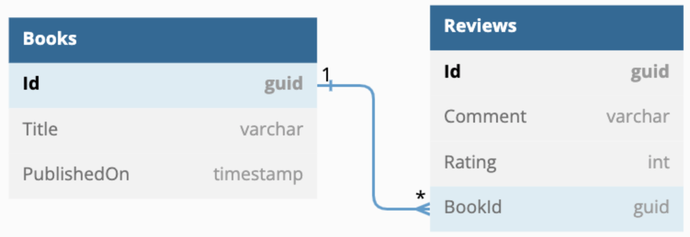
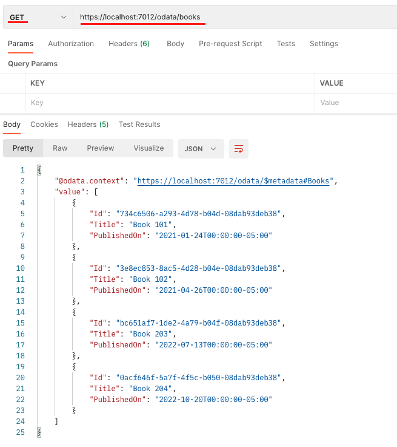
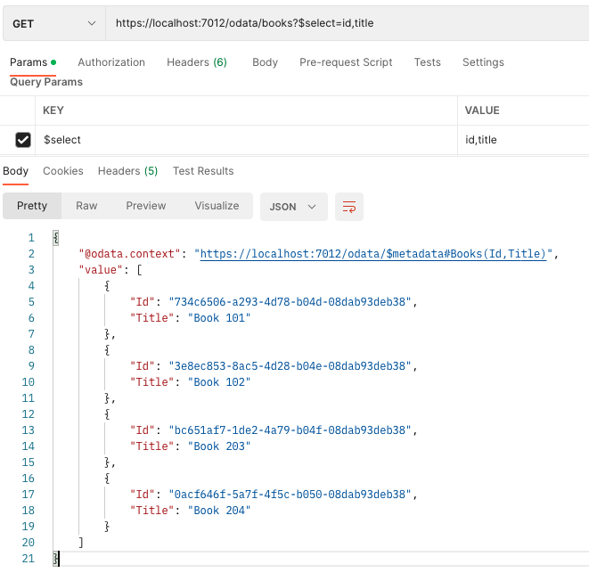
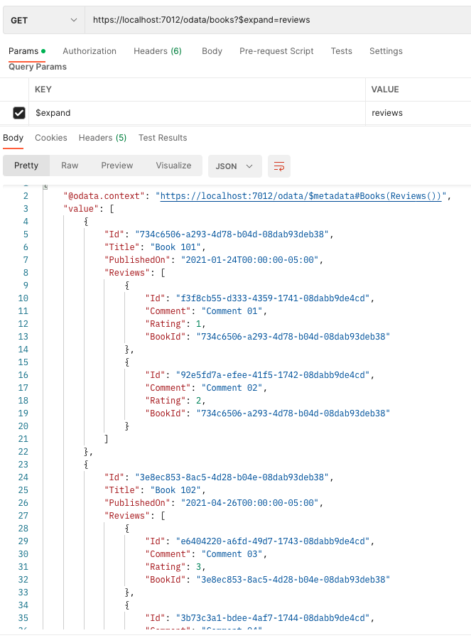
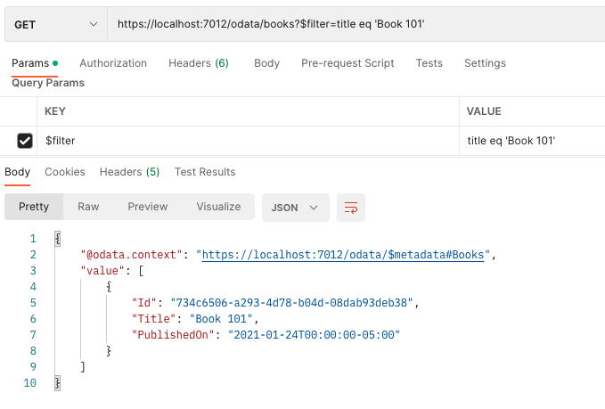
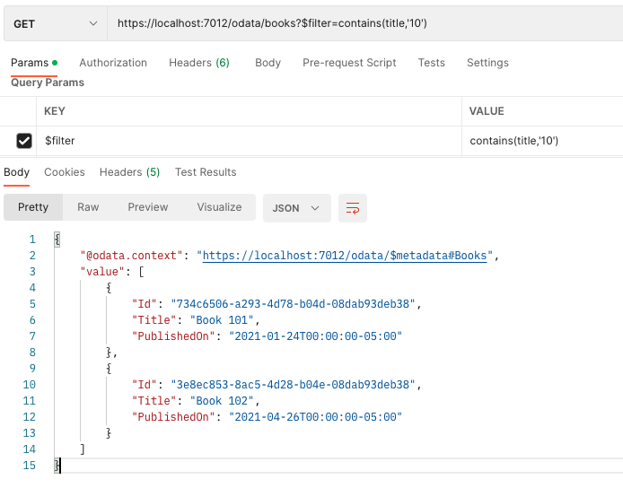
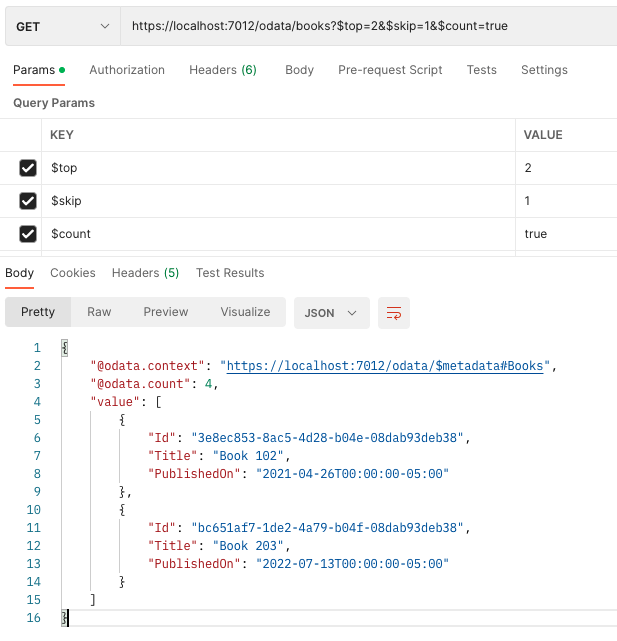
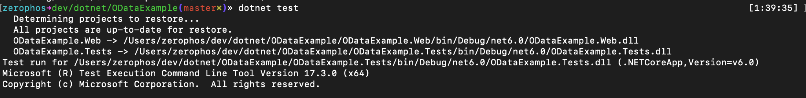
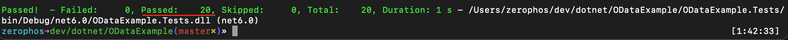
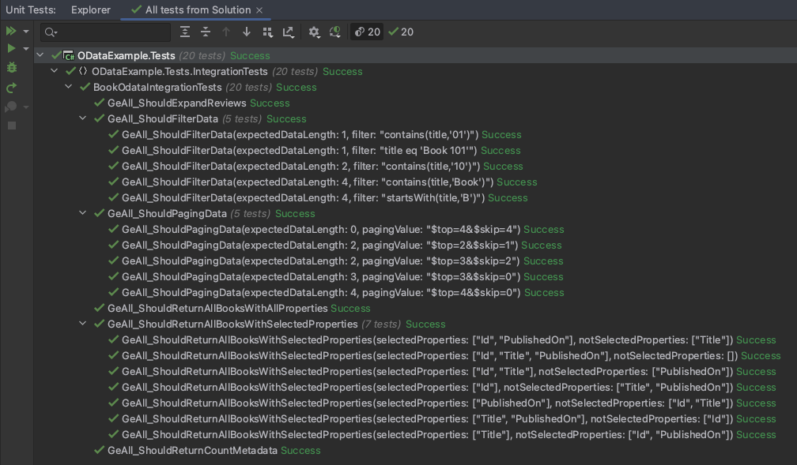

# A brief example of working with DotNet Core and OData
This is a DotNet Core web api repo that uses OData to prevent over-fetching and under-fetching.

[OData](https://www.odata.org), short for Open Data Protocol, is an open protocol to allow the creation and consumption of queryable and interoperable RESTful APIs in a simple and standard way.

In this example, we are going to create a Web API to request for some data. **OData will be in charge of loading only the required data**.
The data model is represented in the next image:
<p align="center">
  
</p>

### Technologies in this repo:
* DotNet Core 6
* OData
* Entity Framework 6 (Code First)
* SQL Server (Docker Container)
* xUnit (Integration Tests)

## Database
We are using SQL Server as the default database, but you can use any Entity Framework supported database.

#### Setup Database
Create the database container (you need to have Docker installed on your system):

```sh
docker run -d --name my-sqlserver -p 1433:1433 -e "ACCEPT_EULA=Y" -e "SA_PASSWORD=My@Passw0rd" mcr.microsoft.com/mssql/server:2019-latest
```

Stop and remove the container when needed:

```sh
docker stop my-sqlserver && docker rm my-sqlserver
```

#### Create Database

Apply the existing migration (run this command in the application root folder):

```sh
dotnet ef database update --project ODataExample.Web
```

## Run and test the application
Run the application and make sure it's listening on port 7012. The app inserts some default data to test the queries.

Open postman and add a new GET request to get the default data over this url https://localhost:7012/odata/books.
<p align="center">
  
</p>

## OData
Let's test the Books controller to fetch some data:

* Get the all the Books and select just the fields 'Id' and 'Title' <br />
`https://localhost:7012/odata/books?$select=id,title`
<p align="center">
  
</p>

* Get the all the Books and load the related entity 'Review' <br />
  `https://localhost:7012/odata/books?$expand=reviews`
<p align="center">
  
</p>

* Get the Book when Title equals to 'Book 01' <br />
`https://localhost:7012/odata/books?$filter=title eq 'Book 101'` 
<p align="center">
  
</p>

* Get the Book when Title contains '10' <br />
`https://localhost:7012/odata/books?$filter=contains(title,'10')`
<p align="center">
  
</p>

* Get 2 Books per page skipping 1 and add the total count (pagination) <br />
`https://localhost:7012/odata/books?$top=2&$skip=1&$count=true`
<p align="center">
  
</p>

## Integrations Tests (xUnit)
I have added some integration tests in the ODataExample.Tests project. To run all the tests just run this command in the application root folder:

```sh
dotnet test
```
<p align="center">
   <br />
  
</p>

Or just run the tests with Visual Studio or Rider
<p align="center">
  
</p>